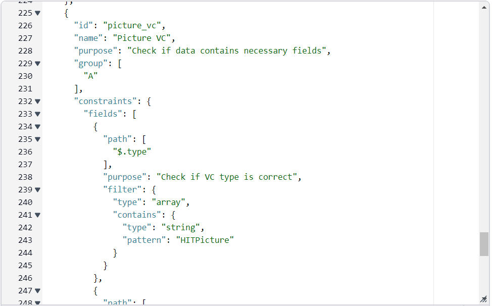
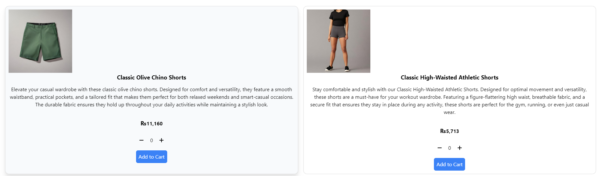
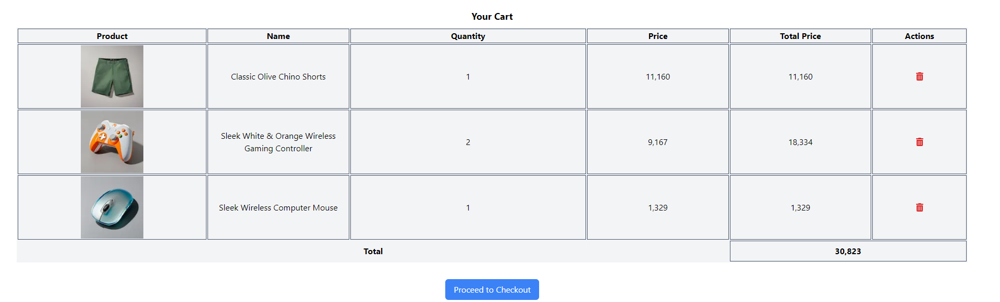
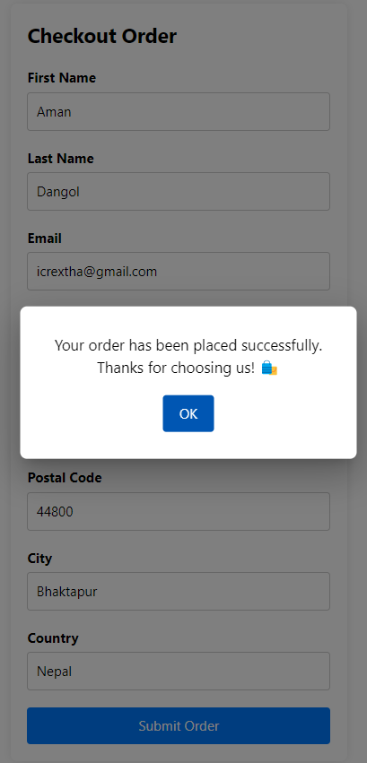

# Bounty - Build Upon the Affinidi Capstone

This updated capstone project builds upon the previous implementation by enhancing the user experience and incorporating additional features using Affinidi's products. The project is an online retail store built using NextJS and leverages Affinidi Login and Affinidi Vault for user authentication and data storage.
To complete this bounty quest, I have made several improvements and enhancements to the existing capstone project. Below are the details of the changes made, along with the links to the deployed site, GitHub repository, and a write-up describing the new features.
First of all, I converted the existing React project to utilize the Next.js framework for improved scalability and easier deployment.

#### New Features and Enhancements:

### Navbar Update:

**Code Reference: components/Navbar.jsx**

In the Navbar component (`Navbar.jsx`), I made several modifications to enhance the user experience and personalize the greeting for authenticated users:

- **Display User Profile Picture**: Added functionality to display the user's profile picture retrieved from Affinidi Vault. This provides a visual representation of the user's identity and enhances the personalization of the user interface.

- **Greeting with Nickname**: Updated the greeting message to use the user's nickname instead of their givenName or first name. This change adds a more casual and personalized touch to the user interaction, making users feel more welcome and engaged.

- **Improved Styling**: Adjusted the styling of the Navbar to accommodate the new elements and ensure a cohesive design. This includes positioning the profile picture and greeting message appropriately within the Navbar and applying styling to maintain consistency with the overall app theme.

- **Dynamic Navigation Buttons**: Implemented dynamic navigation buttons based on the user's authentication status. For authenticated users, the Navbar displays buttons for accessing the cart and logging out. For unauthenticated users, a login button is displayed instead.
  
  

### Currency Matching User's Country:

**Code Reference: /product_homepage/product.jsx**

To enhance the user experience and make the product prices more relevant to the user, I implemented a feature to match the currency displayed on the website with the user's country. Here's how it works:

1. **Currency Selection**: When a user logs in using Affinidi Login, their country information is retrieved from Affinidi Vault. Based on this information, the currency corresponding to the user's country is determined.

2. **Price Conversion**: The product prices displayed on the website are converted from US dollars (USD) to the user's local currency using the latest currency exchange rates. This ensures that the prices reflect the purchasing power and economic context of the user's country.

3. **Dynamic Currency Display**: The currency symbol displayed alongside the product prices is dynamically updated to match the user's local currency. This provides users with a familiar and convenient shopping experience, as they can easily understand the prices in their own currency.

By implementing this feature, users can now view product prices in their local currency, making the shopping experience more personalized and relevant to their location.

### Product Data Fetching and Display:

**Code Reference: /product_homepage/product.jsx**

To ensure a dynamic and up-to-date product catalog, I integrated an API to fetch product data directly from an external source. Here's how this feature enhances the user experience:

1. **API Integration**: I leveraged an external API to fetch product data, ensuring that the website's product catalog is always up-to-date with the latest offerings. This allows for a dynamic and diverse selection of products to be displayed to users.

2. **Appealing Display**: The fetched product data is displayed in a visually appealing and organized manner on the website. Each product is showcased with its image, title, description, and price, presented in a clean and intuitive layout.

3. **Enhanced User Experience**: By fetching product data from an API, users are provided with a seamless browsing experience, enabling them to explore a wide range of products conveniently. The beautiful display of products enhances engagement and encourages users to discover new items.

4. **Responsive Design**: The product display is optimized for various screen sizes and devices, ensuring that users can easily browse and interact with the catalog regardless of their device type.

With this feature, users can enjoy a visually engaging shopping experience while exploring the diverse range of products available on the website.

### Cart Page Enhancement:

**Code Reference: /cart/page.jsx**

To improve the usability and visual appeal of the cart page, I implemented several enhancements and modifications:

1. **Table Modification**: I revamped the layout and design of the cart page by modifying the table structure. This includes adjusting column widths, spacing, and alignment to ensure a more organized and visually appealing presentation of cart items.

2. **Delete Icon with Functionality**: I added a delete icon next to each item in the cart, allowing users to easily remove items from their cart with a single click. This intuitive functionality enhances the user experience by providing a quick and convenient way to manage cart contents.

3. **Improved Styling**: The cart page underwent styling enhancements to achieve a more cohesive and aesthetically pleasing appearance. This includes refining color schemes, typography, and element spacing to create a visually harmonious layout.

4. **Dynamic Total Calculation**: I implemented dynamic calculation of the total price based on the items in the cart. As users add or remove items, the total price updates dynamically, providing real-time feedback on the cost of their cart contents.

With these modifications, the cart page offers a seamless and enjoyable shopping experience, empowering users to easily manage their cart items and make informed purchase decisions.
 

#### Conclusion

This updated capstone project showcases the integration of Affinidi's products to create a more personalized and seamless online shopping experience. By leveraging zero-party data and additional information stored in Affinidi Vault, the project enhances user engagement and satisfaction while maintaining security and privacy.
